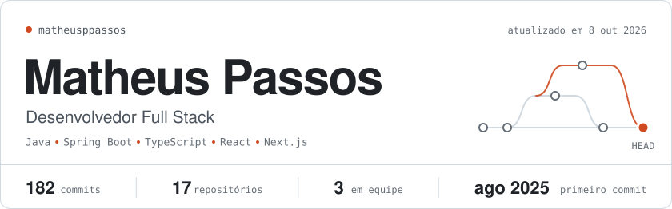
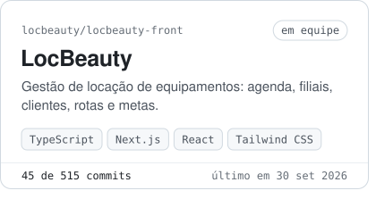
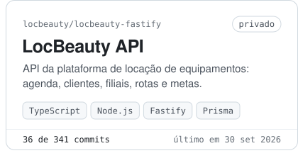
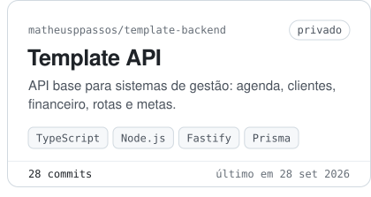
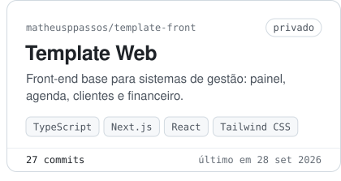
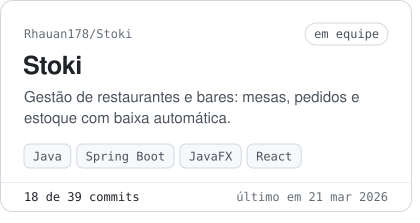
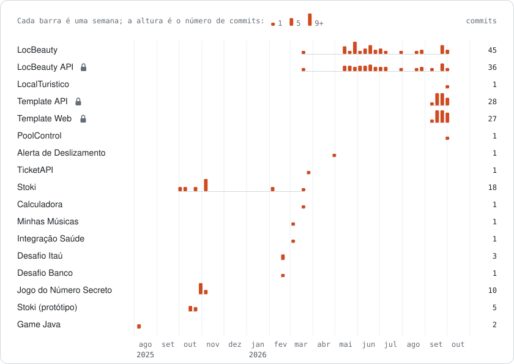

<!-- header:start -->
<picture><source media="(prefers-color-scheme: dark)" srcset="assets/header-dark.svg"></picture>
<!-- header:end -->

Olá! Sou o Matheus, desenvolvedor full stack. No back-end construo APIs com **Java e Spring Boot** e com **Node.js, Fastify e Prisma**; no front-end, interfaces com **React, Next.js e TypeScript**. Hoje contribuo com o front-end e a API da **LocBeauty**, uma plataforma de gestão de locação de equipamentos, mantenho templates full stack para sistemas de gestão e sigo praticando com desafios de back-end, projetos em equipe e um pouco de hardware com Arduino.

## Em destaque

<!-- featured:start -->

<a href="https://github.com/locbeauty/locbeauty-front"><picture><source media="(prefers-color-scheme: dark)" srcset="assets/card-locbeauty-locbeauty-front-dark.svg"></picture></a><picture><source media="(prefers-color-scheme: dark)" srcset="assets/card-locbeauty-locbeauty-fastify-dark.svg"></picture><picture><source media="(prefers-color-scheme: dark)" srcset="assets/card-matheusppassos-template-backend-dark.svg"></picture><picture><source media="(prefers-color-scheme: dark)" srcset="assets/card-matheusppassos-template-front-dark.svg"></picture><a href="https://github.com/Rhauan178/Stoki"><picture><source media="(prefers-color-scheme: dark)" srcset="assets/card-rhauan178-stoki-dark.svg"></picture></a>

<!-- featured:end -->

## Linha do tempo de commits

<!-- timeline:start -->
<picture><source media="(prefers-color-scheme: dark)" srcset="assets/timeline-dark.svg"></picture>
<!-- timeline:end -->

## Stack

<!-- stack:start -->
<picture><source media="(prefers-color-scheme: dark)" srcset="assets/stack-dark.svg"></picture>
<!-- stack:end -->

## Todos os repositórios

<!-- repos:start -->
| Projeto | Sobre | Commits |
| :-- | :-- | --: |
| [**LocBeauty**](https://github.com/locbeauty/locbeauty-front) em equipe · locbeauty | Plataforma de gestão para locação de equipamentos: agendamentos, filiais, clientes, rotas, metas e dashboards. `TypeScript` `Next.js` `React` `Tailwind CSS` `TanStack Query` | **45**&nbsp;de&nbsp;515 último:&nbsp;set&nbsp;2026 |
| **LocBeauty API** privado | API da plataforma de locação de equipamentos: agendamentos, clientes, filiais, rotas e metas, com login JWT. `TypeScript` `Node.js` `Fastify` `Prisma` `PostgreSQL` `Docker` `Vitest` | **36**&nbsp;de&nbsp;341 último:&nbsp;set&nbsp;2026 |
| [**LocalTuristico**](https://github.com/matheusppassos/LocalTuristico) | Sem descrição. `HTML` | **1** último:&nbsp;set&nbsp;2026 |
| **Template API** privado | API base para sistemas de gestão, com agenda, clientes, financeiro, rotas, metas e acesso por filial. `TypeScript` `Node.js` `Fastify` `Prisma` `PostgreSQL` `Docker` `Vitest` | **28** último:&nbsp;set&nbsp;2026 |
| **Template Web** privado | Front-end base para sistemas de gestão: painel, agenda, clientes, equipamentos, financeiro, rotas e metas. `TypeScript` `Next.js` `React` `Tailwind CSS` `TanStack Query` | **27** último:&nbsp;set&nbsp;2026 |
| [**PoolControl**](https://github.com/matheusppassos/poolcontrol) | Controle de entrada e saída da piscina do condomínio, respeitando a capacidade máxima. `Java` | **1** último:&nbsp;set&nbsp;2026 |
| [**Alerta de Deslizamento**](https://github.com/matheusppassos/Alerta-Deslizamento) | Protótipo com Arduino: o sensor detecta movimento do solo, dispara o alarme e aciona a bomba d'água. `C++` `Arduino` `PlatformIO` | **1** último:&nbsp;mai&nbsp;2026 |
| [**TicketAPI**](https://github.com/matheusppassos/TicketAPI) | API REST de chamados com prioridade e status, validação, persistência JPA e documentação OpenAPI. `Java` `Spring Boot` `Spring Data JPA` `H2` `OpenAPI` `Maven` | **1** último:&nbsp;mar&nbsp;2026 |
| [**Stoki**](https://github.com/Rhauan178/Stoki) em equipe · Rhauan178 | Gestão de restaurantes e bares: mesas, pedidos e estoque de ingredientes com baixa automática. `Java` `Spring Boot` `JavaFX` `React` `JavaScript` `Maven` | **18**&nbsp;de&nbsp;39 último:&nbsp;mar&nbsp;2026 |
| [**Calculadora**](https://github.com/matheusppassos/Calculadora) | Calculadora em Java. `Java` | **1** último:&nbsp;mar&nbsp;2026 |
| [**Minhas Músicas**](https://github.com/matheusppassos/DesafioMusica) | Modelagem orientada a objetos de músicas, podcasts e favoritos. `Java` | **1** último:&nbsp;mar&nbsp;2026 |
| [**Integração Saúde**](https://github.com/matheusppassos/IntegracaoAPI) | API para receber e integrar resultados de exames laboratoriais. `Java` `Spring Boot` `Maven` | **1** último:&nbsp;mar&nbsp;2026 |
| [**Desafio Itaú**](https://github.com/matheusppassos/DesafioItau) | API REST de transações com cálculo de estatísticas, atualizada para Java 21. `Java` `Spring Boot` `Maven` | **3** último:&nbsp;fev&nbsp;2026 |
| [**Desafio Banco**](https://github.com/matheusppassos/desafio-banco) | Interface de conta bancária no terminal. `Java` | **1** último:&nbsp;fev&nbsp;2026 |
| [**Jogo do Número Secreto**](https://github.com/matheusppassos/jogo-do-numero-secreto) | Jogo web de adivinhação com narração por voz. `JavaScript` | **10** último:&nbsp;nov&nbsp;2025 |
| [**Stoki (protótipo)**](https://github.com/matheusppassos/Stoki) | Primeira versão do Stoki, com as telas desktop do restaurante em JavaFX. `Java` `JavaFX` | **5** último:&nbsp;out&nbsp;2025 |
| [**Game Java**](https://github.com/matheusppassos/Game-Java) | Minijogo de batalha por turnos entre avatares. `Java` | **2** último:&nbsp;ago&nbsp;2025 |

182 commits meus em 17 repositórios (3 privados, sem link), somando todos os branches. Atualizado automaticamente em 9 out 2026.
<!-- repos:end -->
